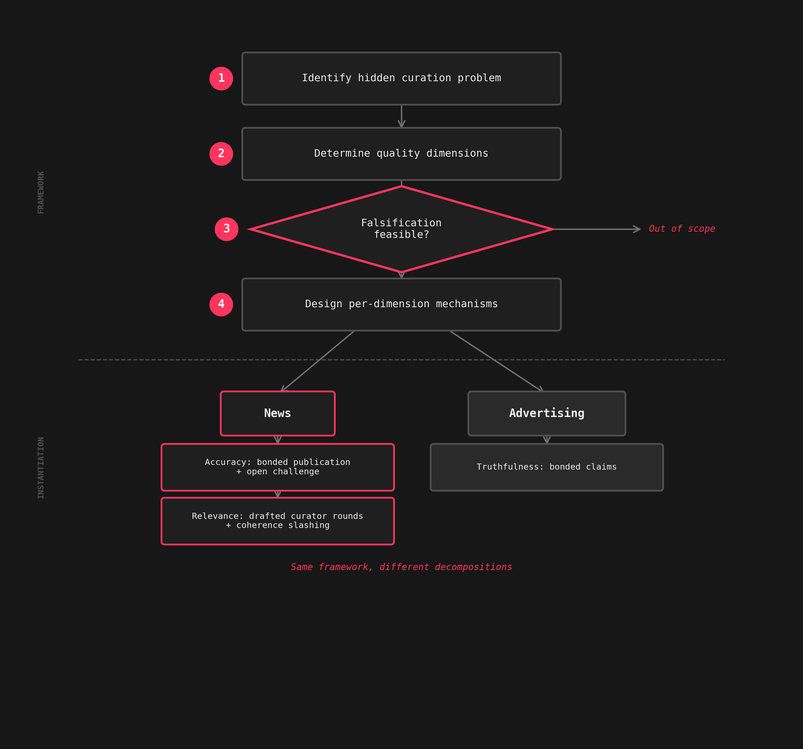
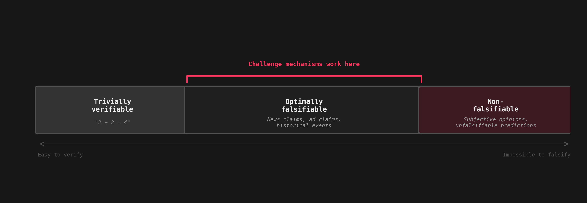
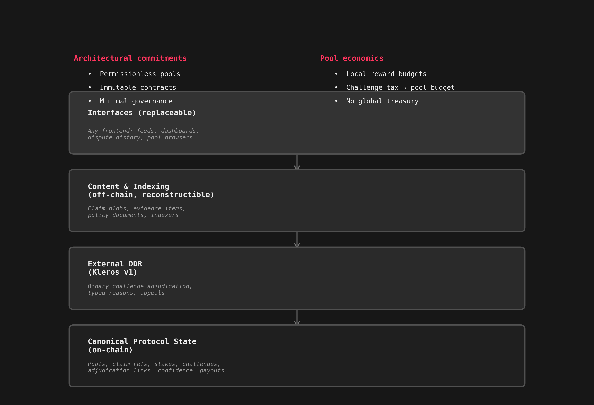
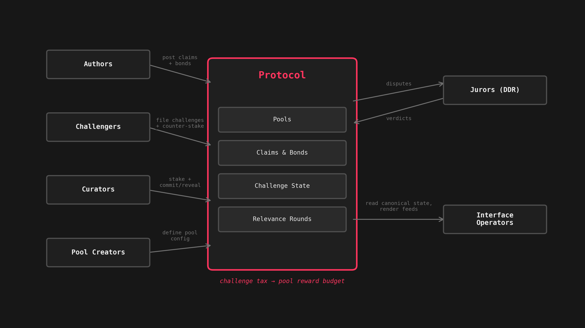
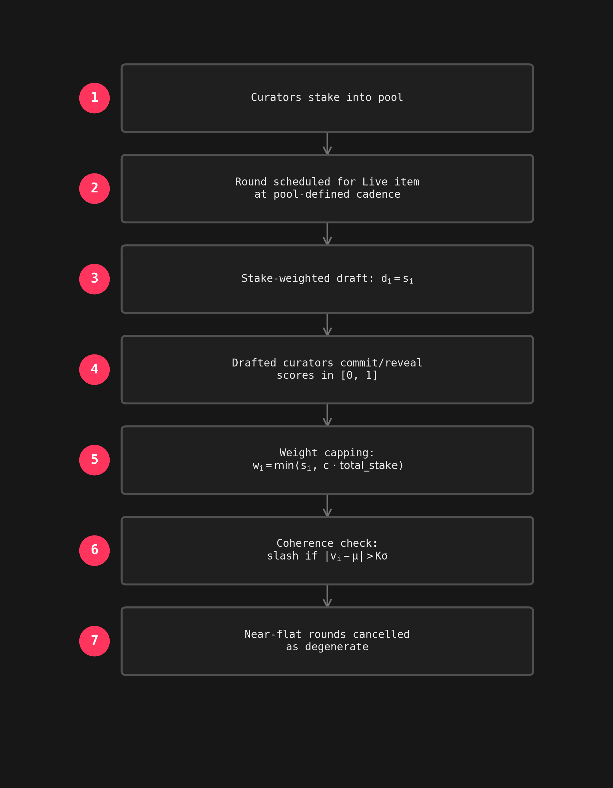
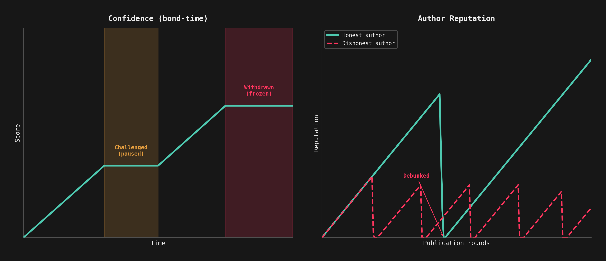
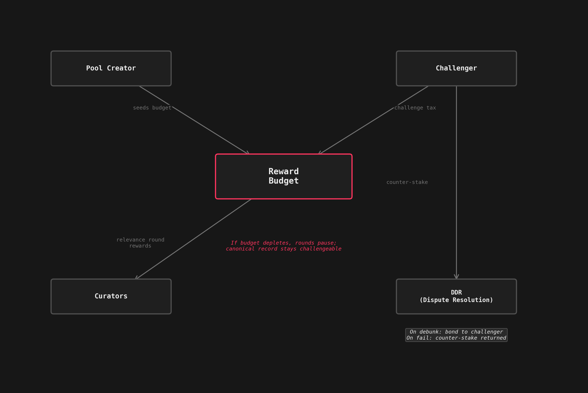

::: {.callout-note appearance="minimal"}


:::

::: {.callout-important appearance="simple"}
**Working draft.** Under active development. [Feedback welcome.](mailto:ferit@cryptolab.net)
:::

# Abstract

The internet solved access to information but not access to knowledge. The unresolved bottleneck is **curation**: the transformation of raw information into decision-grade knowledge. This bottleneck is upstream of many failures usually described as failures of governance, media, or coordination. The problem is becoming structurally worse because generative AI makes the form of quality cheap while leaving the substance of quality expensive. We can now generate fluent prose, plausible structure, and respectable presentation far more cheaply than we can generate correctness, coherence, or grounded judgment.

This paper argues that many hard problems decompose into a curate-then-coordinate structure and that the difficulty is concentrated in the curation phase rather than the coordination phase. It proposes a general framework for trustless decentralized curation. The framework has four steps: identify the hidden curation problem behind an apparent downstream failure; identify the relevant quality dimensions; require falsifiability where the mechanism depends on challenge; and design distinct mechanisms for each quality dimension instead of collapsing all quality into one score. We instantiate the framework for news, where two dimensions dominate: **accuracy**, which is global and binary, and **relevance**, which is local and scalar.

The protocol design reflects that decomposition. Accuracy is handled through bonded publication, open challenges, and external decentralized dispute resolution. Relevance is handled through drafted curator rounds under a public policy, with coherence-based rewards and slashing. Confidence is accumulated bond-time rather than a truth label. Author reputation acts as a slow-moving non-monetary bond. Pool creation is permissionless, contracts are treated as immutable, and governance is minimized by design: we prefer no need for governance over good governance.

Truth Post, launched in 2023, implemented the accuracy layer only. The deployment failed to bootstrap sustained participation, but it proved the submission-and-challenge flow functions on-chain, and the bootstrapping failure drove the complete redesign presented here. Redesigned simulations in this paper show that debunking false claims is economically attractive under reasonable juror accuracy, that drafted-curator relevance rounds filter competence while remaining vulnerable above a concrete collusion threshold, and that author reputation as a standing bond creates useful separation between honest and dishonest publishers without reintroducing reputation-weighted voting.

This paper addresses only the information-to-knowledge transformation. Coordination given trusted shared knowledge is out of scope.

# Introduction

When you search for travel destinations, you are consuming someone else's curation. When you read a newspaper, you are consuming someone else's curation. When you rely on rankings, reviews, feeds, summaries, or recommendations, you are outsourcing judgment. That is useful. No individual can verify, sort, and evaluate the whole world manually. But the moment you depend on a curator, you inherit that curator's competence, incentives, and failure modes.

This dependency matters because information is not knowledge. Raw information becomes useful only after it has been selected, verified, and contextualized. That transformation is curation. The internet radically improved access to information; it did not solve access to knowledge.

This paper argues that **many hard problems decompose into curate-then-coordinate, and that the difficulty is concentrated in the curation phase, not the coordination phase.**

Take news. A newspaper is a curated set of claims about reality. People consume those claims and then make decisions. In a democracy, those decisions are collective and consequential. If the curation layer is incompetent, voters act on low-quality knowledge. If the curation layer is weaponized, voters act on poisoned knowledge [@chomsky1988manufacturing]. In both cases the downstream damage is the same: people coordinate on corrupted inputs.

This is why I argue that many coordination failures are misdiagnosed. We keep trying to fix governance, voting, or collective decision-making directly while standing on a broken knowledge layer. People cannot coordinate well without a trusted shared reality. If two people trust that two plus two equals four, there is no coordination problem there; the shared fact scales. But when two groups inhabit different constructed realities about politics, institutions, or public events, governance becomes hard not because humans are incapable of coordination, but because the knowledge layer underneath coordination is broken.

So governance is often a hidden curation problem.

This paper addresses that upstream layer only. It is about the transformation from information into decision-grade knowledge, not about coordination after knowledge has been established. That distinction matters. The downstream coordination literature is rich. My claim is that many deployments fail before that stage because the curation layer is missing, captured, or opaque.

## Information abundance, knowledge scarcity

The internet gave everyone access to unprecedented volumes of information. It did not give everyone access to reliable knowledge. The distinction is structural. A pile of unsorted books and a library can contain the same pages; what differs is the mechanism that organizes, filters, and makes them usable.

The progression from data through information to knowledge is a well-established concept in information science, formalized in Ackoff's DIKW hierarchy [@ackoff1989dikw]. The hierarchy names the levels but does not specify how the transformation between them is performed or verified. Subsequent critiques have noted exactly this gap: the framework is descriptive, not prescriptive. This paper proposes concrete mechanisms for one transition in that hierarchy: from information to decision-grade knowledge, through selection, verification, and contextualization.

Historically, some of that mechanism was carried by institutions: newspapers, journals, universities, editors, teachers, peer reviewers. Those institutions were imperfect, but they were legible enough that users could at least understand where the curation happened. Today we have more information than ever and weaker, more opaque transformations from information into knowledge.

Generative AI makes the gap wider. Producing functional software required understanding it; writing a convincing paper required the competence it demonstrated. That requirement functioned as an implicit proof of work: the cost of producing the artifact was inseparable from the knowledge it signaled. AI breaks this coupling by making production possible without understanding. The *form* of quality is now cheap: formatting, fluency, plausible citation patterns, respectable structure. The *substance* of quality remains expensive: correctness, coherence, domain understanding, and judgment. We are entering a regime of **information abundance and knowledge scarcity**.

That is why curation is not a side problem. It is becoming the central bottleneck in collective decision-making.

## Contributions

This paper contributes:

- **A general framework for trustless decentralized curation.** The framework is not a news-only theory. It is a method for identifying when decentralized curation is feasible and how to decompose the mechanism.
- **A complete end-state protocol architecture for Truth Post.** The design separates accuracy from relevance, distinguishes on-chain canonical state from replaceable interfaces, makes pool creation permissionless, and treats contracts as immutable with cross-version coexistence rather than in-place upgrades.
- **A simulation-based evaluation program.** The experiments test the economic viability of challenge-based accuracy verification, the filtering power and collusion resistance of drafted-curator relevance rounds, and the separating effect of author reputation as a standing bond.
- **A deployment retrospective.** Truth Post (2023) proved the on-chain submission-and-challenge flow and revealed the bootstrapping conditions the current design must satisfy.

# A General Framework For Trustless Decentralized Curation

The central contribution of this paper is a general four-step framework (@fig-framework):

1. **Problem definition.** Identify the hidden curation problem inside what is usually described as a downstream failure.
2. **Quality identification.** Determine which dimensions of information quality actually matter in the target domain.
3. **Falsifiability requirement.** Use challenge-based mechanisms only where falsification is feasible and cheaper than exhaustive verification.
4. **Mechanism design by dimension.** Design different mechanisms for different quality dimensions instead of forcing all quality into one signal.

The framework is deliberately domain-agnostic. What changes across domains is not the method, but the quality decomposition and the mechanism mix.

{#fig-framework}

## Step 1: identify the hidden curation problem

Some failures are obviously curation failures: ranking systems, review systems, recommendation engines, editorial systems. Others are not. Governance is the most important example. A building association, a shared asset, a DAO, or a city council can have aligned incentives in the abstract and still fail to act because participants do not share a reliable picture of reality. In these cases the coordination layer may be functioning exactly as designed. The upstream failure is the curation layer that feeds it.

The same pattern appears in markets. Akerlof's "lemons" problem shows what happens when buyers cannot distinguish quality before purchase [@akerlof1970lemons]. In information markets, high-quality content is expensive to produce and low-quality content is cheap. If the curation layer cannot make quality legible, low-quality content captures distribution and high-quality producers are punished for their costs. A badly curated ranking does not merely misinform; it selects against excellence.

## Step 2: identify the relevant quality dimensions

Information quality is not one thing. Wang and Strong's data-quality work is useful here because it treats quality as multidimensional rather than monolithic [@wang1996beyondaccuracy]. Different domains care about different dimensions: accuracy, relevance, timeliness, interpretability, completeness, accessibility, and so on.

The practical consequence is simple: there is no universal curation mechanism. If a system tries to compress all quality into one score, it usually confuses properties that need different incentives.

## Step 3: require falsifiability

Popper's core point remains operationally useful: a claim is meaningful for scientific inquiry when it exposes itself to potential refutation [@popper1959logic]. The same asymmetry matters here. If a claim is trivially verifiable, a curation mechanism is unnecessary. If a claim is not falsifiable at all, a challenge mechanism has nothing to latch onto.

The relevant region is the middle one (@fig-falsifiability):

- verification is difficult or expensive
- falsification is feasible
- the evidence needed to falsify is publicly accessible

News fits this structure well. A claim that an event happened can be expensive to verify exhaustively, but later evidence can still debunk it. The mechanism therefore does not need to prove all truth from scratch. It needs to make falsehood attackable.

{#fig-falsifiability}

## Step 4: design mechanisms dimension by dimension

Different dimensions need different mechanisms. In the news domain, accuracy and relevance are not the same problem. Accuracy is global and binary: a claim either withstands a debunking challenge or it does not. Relevance is local and scalar: what matters depends on the pool's public policy, scope, and current context.

Trying to solve both with one mechanism is a category error.

## A second instantiation: advertising

Advertising shows that the framework is not confined to journalism. Advertising is largely a competition for attention in which participants keep spending until the game reaches its feasibility limit. In that sense it resembles other negative-sum escalation games: arms races, extractive competition, or resource-burning contests.

A different advertising game is possible. Instead of paying for distribution regardless of truth, advertisers can express ads as claims and post a bond behind them. If the claim is true, the cost is mainly temporary capital lockup. If the claim is false, the capital is lost to challengers. This inverts the current cost structure: honest advertisers are cheap to accommodate, dishonest advertisers become expensive.

Advertising therefore serves two purposes in this paper. It demonstrates that the framework generalizes beyond news, and it provides a plausible funding source for curation labor even when political or journalistic disputes are quiet [@juniperresearch2023adfraud].

# Instantiating The Framework For News

News is the first serious instantiation because the curation problem is socially visible, broadly distributed, and politically consequential.

## Accuracy and relevance

Applying the framework to news yields two dominant quality dimensions:

- **Accuracy.** Claims should withstand public challenge under an explicit evidence standard.
- **Relevance.** Claims should matter relative to the pool's curation goal.

Accuracy alone is not sufficient. A claim like "one equals one" is accurate, but it is not news. A world-politics pool that publishes accurate football trivia has not solved its curation problem. Relevance is therefore not an optional add-on. It is a separate dimension with different structure and different incentives.

## Falsifiability and claim structure

The protocol cannot operate on vibes. It needs claims that expose themselves to challenge. In the complete design, the unit is a **claim blob**: a content-addressed article or item that may contain multiple propositions. A challenger does not need to attack the entire blob at once; they identify an explicit challenged proposition in natural language. If that challenge succeeds, the entire item is debunked.

This design intentionally avoids pretending that the protocol determines truth in an absolute sense. The complete design tracks claims along two separate state dimensions. The **operational state** records the claim's lifecycle position:

- `Live`: the item is active, bonded, and challengeable. Confidence accrues.
- `PendingEdit`: the author is preparing a new revision. Confidence is paused. The claim remains challengeable on its last finalized revision.
- `WithdrawPending`: the author has initiated withdrawal. A cooldown period runs during which challenges are still accepted.
- `Challenged`: an active dispute is in progress. Confidence is paused.
- `Closed`: a challenge succeeded; the claim is terminal for feed purposes.
- `Withdrawn`: the author removed the bond after the cooldown; the item remains visible historically with frozen confidence.

The **adjudication outcome** records the result of accuracy disputes separately:

- `Unchallenged`: no challenge has been resolved.
- `ChallengeFailed`: a challenge was resolved in the author's favor.
- `Debunked`: a challenge succeeded, whether by counter-evidence, because the challenged proposition was non-falsifiable, because the claim violated the pool's topic scope, or because the claim failed the pool's template requirements.

The important point is institutional modesty. Truth Post is not an oracle of metaphysical truth. It is a system for transparency, contestability, and incentives.

# Complete Truth Post Design

This section treats the current Truth Post blueprint as the canonical design. The 2023 deployment is not the design source of truth; it is a partial historical predecessor.

## Architectural stance

Three architectural commitments anchor the design:

1. **Permissionless pools.** Any address may create a pool with a domain, a claim template, an evidence policy, and a relevance policy. If the pool is bad, interfaces and users can ignore it.
2. **Immutable contracts.** Protocol changes require new deployments and cross-version aggregation, not in-place upgrades.
3. **Minimal governance.** The preference ordering is: eliminating the need for governance is best; good governance is acceptable; bad governance is worse; and no governance at all (ungoverned failure modes) is worst. If a design can eliminate a governance surface, it should.

These commitments are not aesthetic. They reduce capture surface area. The closer a protocol gets to "someone must govern this correctly forever," the closer it gets to rebuilding the same trust problem at a different layer.

The departure from Ostrom's commons governance framework is deliberate [@ostrom1990commons]. Ostrom's design principles assume participants with persistent identity, bounded exit options, and repeated face-to-face interaction. Digital curation pools have none of these properties: participants are pseudonymous, exit is costless, and interaction is mediated by code rather than social norms. In this environment, governance surfaces are more capturable (because identity is cheap) and exit is more attractive than voice (because switching pools is free). The preference ordering follows from this observation: when governance is easy to capture and exit is easy, eliminating governance surfaces dominates designing elaborate governance.

## Canonical system boundary

Truth Post is not a single website. The protocol has four layers (@fig-architecture):

- **Canonical protocol state:** pools, claim references, stakes, challenge state, adjudication links, confidence accounting, and payout logic.
- **External DDR:** binary challenge adjudication with typed challenge reasons and appeals, delegated to an external decentralized dispute resolution provider.
- **Content and indexing:** claim blobs, evidence items, policy documents, and indexers that reconstruct feeds and histories from canonical state.
- **Interfaces:** any frontend or application that renders feeds, article pages, pool dashboards, or dispute history.

This split is part of the design, not an implementation detail. A protocol with one fragile frontend is not practically decentralized. The same claim blob CID may be posted to multiple pools as independent claims; each pool instance has independent adjudication, confidence, and relevance.

{#fig-architecture}

## Actors

- **Authors** submit claim blobs, post author bonds, and may later withdraw or amend claims.
- **Challengers** file counter-stake, counter-evidence, and an explicit challenge reason against a challenged proposition.
- **Curators** stake into pools and become eligible for drafted relevance rounds.
- **Jurors** belong to the external decentralized dispute resolution layer and adjudicate only accuracy disputes.
- **Pool creators** define one pool configuration. They do not govern the protocol as a whole.
- **Interface operators** decide what to surface, feature, warn about, or ignore.
- **Readers** consume the outputs and may later become authors, challengers, or curators.

{#fig-actor-flow}

## Accuracy layer

The accuracy mechanism is a bonded publication and challenge system (@fig-claim-states).

1. An author posts a claim blob and locks a bond. Contracts enforce minimal structural field presence at submission (non-empty CIDs, valid version pointers).
2. The item enters `Live` status immediately and remains challengeable while bonded. Authors may adjust their bond while live, subject to a pool-scoped grace period; the old bond rate continues for confidence accrual and challenge pricing until the adjustment takes effect.
3. A challenger may file one active challenge at a time against a specific proposition inside the item, with queued challenges allowed behind it. Challenges may also be filed against claims in `PendingEdit` or `WithdrawPending` states, targeting the last finalized revision.
4. The challenger pays a counter-stake (`max(pool minimum, bond/4)`), a challenge tax (a pool-configurable percentage of the pinned bond), and the external DDR fee. Each challenge is pinned to the challenged revision, manifest CID, and bond at filing time, so later edits or bond changes do not alter the dispute target or payout basis. For queued challenges, the counter-stake, tax, and DDR fee remain in escrow until activation; tax is credited to the pool budget only on activation.
5. The dispute goes to external DDR with a binary question: should the challenge succeed?
6. If the challenge succeeds, the item moves to `Closed` with adjudication outcome `Debunked`, and the bond is transferred according to the payout rules. If the challenge fails, the item returns to its pre-challenge operational state.

The protocol supports four typed challenge reasons, none of which is a separate final verdict. All yield `Debunked` on success:

- `Debunking`: the challenged proposition is factually false.
- `NonFalsifiable`: the challenged proposition fails to instantiate a falsifiable claim under the pool's template and evidence policy.
- `ScopeViolation`: the claim does not belong in the pool's declared topic domain.
- `TemplateViolation`: the claim passes on-chain structural checks but fails the pool's semantic template requirements (e.g., missing required fields or disallowed source classes). On-chain structural validation is enforced at submission; semantic template conformance is enforceable post-publication through this challenge reason.

{#fig-claim-states}

## Relevance layer

The relevance mechanism is a drafted curator coherence game (@fig-relevance-round).

1. Curators stake into a pool.
2. Relevance rounds are scheduled for `Live` items at a pool-defined cadence.
3. Curators are drafted using a stake-weighted lottery. Let $s_i$ denote curator $i$'s staked capital and $d_i$ denote that curator's draft weight:

$$
d_i = s_i
$$

4. Drafted curators commit and reveal relevance scores in $[0,1]$.
5. Final round weight is based on **slashable stake only**. Let $w_i$ denote curator $i$'s effective round weight, and let $c$ denote the maximum share of total committee stake any one curator may contribute:

$$
w_i = \min(s_i, c \cdot \text{total committee stake})
$$

6. The protocol computes the weighted mean $\mu$ of submitted scores and the weighted standard deviation $\sigma$. Let $v_i$ denote curator $i$'s revealed score and let $K$ denote the coherence-threshold multiplier. Curators outside the coherence band are slashed:

$$
|v_i - \mu| \le K\sigma
$$

7. Near-flat rounds are cancelled as degenerate rather than accepted as meaningful curation.

{#fig-relevance-round}

This design keeps curation entirely stake-driven: no reputation-weighted mechanism influences either drafting or voting. That is a major departure from the earlier design.

## Confidence

Confidence is not a truth label. It is accumulated bond-time. Let $C$ denote the resulting confidence score, let $B_t$ denote the bond active during interval $\Delta t$, and let the summation run over the item's bonded history:

$$
C = \sum_t B_t \cdot \Delta t
$$

The semantics are simple:

- larger bond means more capital at risk
- longer survival means longer exposure to challenge
- challenge pauses accumulation; a successful defense resumes accrual from the paused integral
- amendment (`PendingEdit -> Live`) resets confidence to zero, since the content has changed
- withdrawal freezes the score permanently

An interface may use confidence for ranking or display, but it must not conflate confidence with a universal truth claim. Confidence measures accumulated capital risk exposure over time, not community validation or endorsement. The scrutiny signal is survival: a `Live` item that has survived an explicit challenge attempt carries stronger evidence of accuracy than one that has simply accumulated bond-time without being tested. @fig-confidence-reputation illustrates these dynamics.

## Reputation

The current design uses a single reputation system:

- **Author reputation** is a pool-scoped, slowly decaying credibility stock. It is not escrowed per claim, but every new claim exposes the author's standing reputation to large downside if the claim is debunked. A reputation update caused by one claim does not affect the confidence or relevance of the author's other claims; each claim continues under its own bond-time history.

The design deliberately avoids any reputation-weighted mechanism for curation. An earlier iteration allowed reputation to directly increase curation weight; the current design rejects that entirely because it grants influence not fully backed by slashable capital. Curation drafting and voting are both purely stake-driven.

{#fig-confidence-reputation}

## Local pool economics

Each pool has its own reward budget (@fig-pool-economics). The pool creator or any sponsor can top it up. Relevance-round reward floors are paid from that local budget, not from a vague global treasury. If the budget runs dry, new relevance rounds pause; the canonical record remains challengeable.

Challenge tax is paid by the challenger and routed to the challenged pool's reward budget. For immediately active challenges, the tax credits at filing; for queued challenges, the tax remains in escrow until activation and is refunded if the challenge is cancelled or mooted by an earlier debunking. This makes pool economics local rather than governance-allocated.

{#fig-pool-economics}

# Equilibrium Analysis

This section formalizes the equilibrium properties of the protocol's core mechanisms. The analysis identifies conditions under which honest strategies are rational for each actor type, and characterizes the boundaries where honest behavior ceases to be a best response.

## Author's strategy

An author who publishes a false claim derives value $V$ if the claim survives (attention, reputational gain, advertising revenue from a false ad). The author posts bond $B$. Let $p_{\text{detect}}$ denote the probability that the false claim is detected, and let $P_{\text{maj}}(p, N)$ denote the probability that a jury of size $N$ reaches the correct binary outcome when each juror is individually correct with probability $p$. The expected value of publishing a false claim is:

$$
\text{EV}_{\text{false author}} = (1 - p_{\text{detect}} \cdot P_{\text{maj}}) \cdot V - p_{\text{detect}} \cdot P_{\text{maj}} \cdot B
$$

Setting $\text{EV}_{\text{false author}} < 0$ and solving for $B$ yields a bond threshold $B^*$ above which false publication has negative expected value:

$$
B^* = V \cdot \frac{1 - p_{\text{detect}} \cdot P_{\text{maj}}}{p_{\text{detect}} \cdot P_{\text{maj}}}
$$

**Proposition 1.** *For any value $V$ that a surviving false claim generates, honest authoring is strictly preferred when the bond exceeds $B^*$. At the representative parameters ($p_{\text{detect}} = 0.35$, $P_{\text{maj}}(0.80, 5) \approx 0.94$), $B^* \approx 2.0V$: the bond must exceed roughly twice the value derived from a surviving false claim.*

The design consequence is direct: bond size must be calibrated to the value at stake. Low-bond items carry low confidence for exactly this reason; the bond is insufficient to deter high-value deception.

## Challenger's entry decision

A challenger does not arrive with a known false claim. They must search. Let $e$ denote the effort cost of examining one claim, let $\beta$ denote the base rate of false claims in the pool, let $p_{\text{detect|examined}}$ denote the probability that examination reveals falsity, and let $\text{EV}_{\text{false}}$ denote the challenger's expected value on a known false claim from the accuracy layer. The expected value of examining one claim is:

$$
\text{EV}_{\text{search}} = \beta \cdot p_{\text{detect|examined}} \cdot \text{EV}_{\text{false}} - e
$$

Searching is profitable when:

$$
\beta > \beta^* = \frac{e}{p_{\text{detect|examined}} \cdot \text{EV}_{\text{false}}}
$$

**Proposition 2.** *Challenger entry is rational only when the false-claim base rate $\beta$ exceeds $\beta^*$. Below this threshold, no rational agent searches, and the system enters a no-challenge equilibrium. This is not a protocol failure when $\beta$ is genuinely low: a pool with few false claims does not need active challengers. The risk is that $\beta$ rises undetected because no one is looking.*

The free-rider dimension compounds this problem [@groves1977freeriderproblem]. A challenger who debunks a false claim produces a public good (a cleaner pool), but bears the full search cost privately. Challenge rewards partially internalize this externality, but the first-mover disadvantage in search remains: rational challengers wait for others to search first.

## Curator voting strategy

The coherence game requires curators to independently report relevance scores in $[0, 1]$. Under commit-reveal, curators cannot observe others' votes before committing. Each curator $i$ has a private signal $\theta_i$ about the true relevance $r$ and forms a belief about the distribution of others' signals. Here $r$ denotes the latent relevance value implied by the pool policy, $\theta_i$ denotes curator $i$'s noisy private estimate of that value, $K$ is the coherence-threshold multiplier from the slashing rule, and $\phi^*$ denotes the largest colluding stake fraction under which honest reporting remains stable.

**Proposition 3.** *Under the coherence mechanism with commit-reveal, honest reporting is a Bayesian Nash equilibrium when the following conditions hold simultaneously:*

*(i) The curation policy is specific enough that all competent curators' private signals $\theta_i$ are distributed around the true relevance $r$ with bounded variance.*

*(ii) The coherence threshold $K$ is large enough that honest reports within normal signal noise are not slashed.*

*(iii) The fraction of deviating curators is below a collusion threshold $\phi^*$ such that the weighted mean remains close to $r$.*

*When condition (iii) fails, a coalition of fraction $\phi > \phi^*$ that coordinates on a biased report shifts the weighted mean toward the coalition's target. Honest reporters may then fall outside the coherence band and be slashed, while dishonest reporters survive. At this point, honest voting ceases to be a best response.*

The collusion threshold $\phi^*$ depends on the cap share $c$, the committee size, and the coherence threshold $K$. E2-Adv characterizes this threshold empirically: at $K = 1.25$ with 15-member committees, the mechanism degrades visibly when the colluding fraction exceeds approximately 0.15 to 0.20.

George's impossibility result constrains what can be claimed here [@george2023strategic]. For games with three or more ranked alternatives and minimal attack resistance, truthful reporting cannot always be a Nash equilibrium. The coherence game escapes this impossibility because curators report on a continuous scalar aggregated by weighted mean with a deviation penalty, not a ranking over discrete alternatives. The game structure is formally different from the ranked-alternative games covered by the impossibility. This escape is defensible but structural rather than airtight: the impossibility does not directly bind, but the coherence game is not immune to all strategic manipulation.

## Participation equilibrium

The system requires authors, challengers, and curators. Each faces a participation decision against an outside option of doing nothing.

**Proposition 4.** *A participation equilibrium exists when:*

*(i) Author entry: honest authors' expected returns (confidence accumulation, reputation) exceed the opportunity cost of bonded capital.*

*(ii) Challenger entry: the false-claim base rate $\beta$ exceeds $\beta^*$, making search profitable.*

*(iii) Curator entry: the per-round expected reward for coherent curators exceeds the opportunity cost of staked capital.*

*The most fragile condition is challenger entry. If $\beta$ drops below $\beta^*$, challengers exit. Their exit may allow $\beta$ to rise, creating a cyclical dynamic rather than a stable equilibrium.*

This cyclical risk is bounded in practice. Some challengers are motivated beyond pure expected value: journalistic reputation, ideological commitment, or interface-level bounties. These non-economic motivations dampen the exit cycle. But the protocol design should not depend on altruism; the bond and reward parameters must make participation viable for rational actors under reasonable assumptions.

# Truth Post 2023: Partial Deployment Evidence

Truth Post launched in 2023 as a partial instantiation of the framework. It implemented the accuracy layer only: authors could submit bonded items, challengers could dispute them, and disputes were routed through Kleros. It did **not** implement the current end-state relevance layer, curator pool, local reward-budget design, multi-interface architecture, or full confidence and reputation system.

The deployment failed to bootstrap sustained usage. That failure matters because it established three things.

First, the bonded-publication and open-challenge flow is deployable on existing infrastructure. Second, accuracy alone is not enough to make the system interesting. People do not come to a curation system to verify boring truths; they come to find what matters. Third, a decentralized protocol with a single fragile frontend is not actually robust.

Truth Post therefore does not validate the whole system. It validates that this work has already crossed the boundary from abstract idea to deployment, failure, and redesign.

# Related Work

This work sits at the intersection of information quality, dispute systems, and cryptoeconomic coordination.

**Data quality.** Wang and Strong's multidimensional treatment of data quality is the main conceptual anchor for the quality-identification step [@wang1996beyondaccuracy]. The key import is methodological: quality must be decomposed before it can be mechanized.

**Falsifiability.** Popper supplies the operational asymmetry between verification and refutation [@popper1959logic]. The mechanism depends on that asymmetry rather than on exhaustive proof.

**Schelling-style coordination and decentralized courts.** Kleros and related systems show how stake, commit-reveal, and appeals can implement decentralized adjudication [@kleros2019shortpaper; @kleros2024yellowpaper]. The complete Truth Post design assumes Kleros v1 as the external DDR provider, with the challenge manager implementing the `IArbitrable` interface. The mechanism is a deliberate Keynesian beauty contest: participants coordinate on expected consensus rather than on truth directly [@bergolla2022kleros; @kleros2021cryptoeconomics]. This structure becomes an information aggregation tool when the focal point is anchored to a substantive standard: in Kleros, jurors coordinate on the legally correct answer because justice is the salient focal point. The coherence game in this paper applies the same pattern, substituting a public curation policy for the legal standard. The beauty contest degenerates only when the focal point is arbitrary or self-referential [@schelling1960strategy; @rojoarjona2021focalpoints; @george2023strategic].

**Oracle and dispute prior art.** Reality.eth and UMA demonstrate optimistic, escalation-based dispute flows for on-chain questions [@realityeth2023; @umaOptimisticOracleDocs; @umaWhitepaperRepo]. Their importance here is not that they solve curation, but that they demonstrate dispute resolution patterns the accuracy layer can reuse.

**Token-curated registries and peer prediction.** TCRs and peer-prediction systems propose other ways to coordinate on list membership or truthful reporting [@goldin2017tcr; @miller2005peerprediction; @prelec2004bts]. Truth Post differs by treating the unit as claims plus evidence plus disputes, and by explicitly separating accuracy from relevance instead of compressing everything into one registry or one elicitation scheme.

**Prediction markets and governance.** Prediction markets and futarchy are related attempts to aggregate dispersed information [@hanson2013futarchy]. They differ in operating cost and question structure. This paper does not use continuous trading markets because the target domains involve high-dimensional claim spaces and semantic disputes rather than a small number of liquid future-event questions.

**Commons governance.** Ostrom remains relevant as a warning and a source of design intuition [@ostrom1990commons]. The point of departure here is that digital curation pools are pseudonymous, permissionless, and exit-heavy. That makes minimizing governance more attractive than designing elaborate governance.

# Threat Model

The protocol assumes adversaries can be rational, coordinated, well-funded, and persistent. The important attacks are:

| Attack | Design response |
|---|---|
| False claims survive because challenging is uneconomic | Bonded publication plus debunking rewards |
| Colluding curators try to bend relevance | Drafted committees, stake-only round weight, weight caps, slashing |
| Non-falsifiable or vague claims exploit semantic ambiguity | Structured claim templates plus `NonFalsifiable` challenge reason |
| Off-topic claims pollute a pool | `ScopeViolation` challenge reason for topic mismatch |
| Claims bypass template rules via direct contract interaction | On-chain structural validation at submission; `TemplateViolation` challenge reason for semantic non-conformance |
| Bad pools set degenerate policies or parameters | Permissionless competition plus interface filtering rather than governance veto |
| A dominant frontend recentralizes discovery | Canonical protocol state and replaceable interfaces |
| Reputation creates unbonded influence | No reputation-weighted curation mechanism exists; author reputation is a separate standing bond only |
| Low-participation pools fail to bootstrap | Pool creators seed local reward budgets; interfaces can ignore inactive pools |
| Stale claims linger forever | Confidence only accumulates while bonded; withdrawn claims remain historical rather than active |

Several threats remain partially unresolved: off-chain collusion, legal pressure against visible participants, pool-policy degeneracy, and coordinated capture above a sufficiently large colluding bloc.

# Evaluation

The evaluation suite is designed to test the current protocol architecture rather than older semantics. It focuses on four questions:

- When is it economically rational to challenge false claims?
- How robust is drafted-curator relevance curation to noise and collusion?
- Does a dedicated `NonFalsifiable` challenge reason materially improve outcomes?
- Does author reputation as a standing bond create useful separation between honest and dishonest publishers?



## E1: Accuracy challenge economics

The accuracy layer is economically useful only if challenging false claims can be rational. We model a challenger who pays counter-stake $S = \max(\text{pool minimum}, B/4)$, challenge tax $\tau$ (a pool-configurable percentage of the pinned bond), and DDR fee $f$ to attack an item with author bond $B$. All challenge economics reference the bond at filing time, so later bond adjustments do not alter the dispute's economic basis. Let $P_{\mathrm{maj}}(p, N)$ be the probability that a jury of size $N$ returns the correct binary outcome when each juror is correct with probability $p$. Challenger expected value on a false claim is:

$$
\mathrm{EV}_{\mathrm{false}} = P_{\mathrm{maj}}(p, N)\cdot(B - \tau - f) + (1-P_{\mathrm{maj}}(p, N))\cdot(-S - \tau - f)
$$

Figure @fig-e1-ev shows that challenger EV becomes strongly positive across the tested stake-to-bounty ratios once juror accuracy moves into plausible territory. Figure @fig-e1-survival shows the corresponding false-claim survival probability after a single detection window.

{#fig-e1-ev}

{#fig-e1-survival}

At the representative point used in the summary, a false-claim challenge at $p=0.80$, $N=5$, and $S/B=0.25$ yields roughly $0.87\times$ bounty expected value for the challenger while false-claim survival remains approximately 0.67 after one window. The survival number is not an indictment of the mechanism; it shows that the dominant bottleneck is detection coverage, not jury math alone.

In practice, $p$ varies by claim difficulty: straightforward factual claims are easier to adjudicate than nuanced or context-dependent ones. The commit-reveal protocol ensures mechanical independence among jurors, and the sweep across $p$ values lets the reader assess performance at any assumed difficulty level.

Bond size is itself the incentive for scrutiny. High-bond items attract challengers because the potential reward justifies the investigation cost; low-bond items attract less scrutiny but also carry proportionally less confidence. In this sense, $p_{\text{detect}}$ is not fully exogenous: it scales with bond size, since larger rewards draw more attention. Items that receive insufficient scrutiny also accumulate insufficient confidence, making the two signals coherent.

### E1-Adv: repeated false-claim attacks

Single-claim economics are insufficient. A real adversary can submit many false claims. E1-Adv therefore simulates a well-funded attacker submitting 50 false items under varying juror accuracy.

{#fig-e1-adv}

The result is economically punitive. At $p=0.80$, the adversary's cumulative balance is deeply negative. Volume does not rescue the attacker; it compounds losses once a sufficient fraction of claims are detected and correctly debunked.

## E2: Relevance with drafted curators

E2 evaluates the current relevance design rather than the earlier weight-allocation model. Curators are drafted into committees from a larger pool using purely stake-weighted selection. Here $\mu$ denotes the weighted mean of committee scores, $\sigma$ denotes the weighted standard deviation, and $K$ denotes the coherence-threshold multiplier used in the slashing rule. Near-flat rounds are cancelled rather than treated as meaningful curation.

{#fig-e2-error}

{#fig-e2-filter}

The results preserve the desired qualitative behavior. When competent curators dominate, relevance error falls and competent stake accumulates. Error bands show 95% confidence intervals over 100 seeds; the evaluation snapshot reports mean error and competent stake share with confidence intervals at the representative point. This is not a theorem of truth; it is a competence filter under a public policy.

### E2-Adv: colluding curators

E2-Adv introduces a colluding bloc of competent-but-biased curators. They vote coherently, but in the wrong direction, and try to survive by redefining the apparent consensus.

{#fig-e2-adv}

The mechanism behaves as expected: small colluding minorities cause limited damage and do not expand much, but sufficiently large coordinated blocs begin to bend the signal and preserve their own stake. The current design does not eliminate this risk. It narrows the attack surface relative to the older reputation-weighted voting model by keeping all curation mechanics purely stake-driven.

## E3: Dedicated `NonFalsifiable` challenges

An earlier version of this manuscript evaluated a third verdict label for ambiguous claims. The current design is different. A non-falsifiable or badly specified proposition should not receive its own truth-status output; it should be challengeable, and a successful challenge should debunk the item.

E3 therefore compares two regimes:

- a baseline that forces binary adjudication even when the challenged proposition is non-falsifiable
- a defended system with a dedicated `NonFalsifiable` challenge reason

{#fig-e3}

The difference is material. At 25% non-falsifiable prevalence, bad-item retention falls from 0.12 to 0.03. That is the right way to understand falsifiability in this protocol: as a precondition for mechanism viability, not as a philosophical embellishment. E3 is a parametric sensitivity analysis: the magnitude of improvement is proportional to the assumed accuracy advantage of the `NonFalsifiable` challenge reason over forced binary adjudication.

## E4: Author reputation after the redesign

The reputation redesign is one of the biggest differences between the current protocol and earlier drafts. Reputation is no longer a generic quantity that directly adds to curation weight. The current design eliminates curator reputation entirely and retains only author reputation as a standing non-monetary bond.

### E4a: author reputation as a standing bond

E4a models honest and dishonest authors under the current author-reputation rules: slow decay, small gains for publication that survives challenge, and large slashes for debunked publication.

{#fig-e4a}

The separation is strong. By round 120, honest authors accumulate meaningful reputation while dishonest authors remain near zero because repeated debunking keeps destroying their standing stock. That is the intended role of author reputation: a non-transferable, slowly earned credibility layer that is expensive to squander. The dishonest-author model uses fixed probabilities of challenge survival; a strategic adversary might adapt by publishing fewer but harder-to-challenge claims, trading volume for per-claim survival.

# Boundary Conditions And Open Problems

This paper establishes an end-state protocol architecture, a mechanism decomposition by quality dimension, and a simulation-based evaluation program grounded in a partial historical deployment. What it does not yet establish is live end-state performance at scale. The right reading of the remaining gaps is therefore not that the framework collapses, but that its claims are bounded by explicit empirical and operational conditions.

## Empirical boundary

No live deployment yet validates the complete design. Truth Post validated only a partial predecessor. The claims in this paper about incentive alignment, competence filtering, and falsifiability defense are therefore claims about the specified design under the analyzed assumptions, not about field performance already demonstrated at scale.

## Inherited dependencies

The protocol delegates accuracy adjudication to an external DDR layer. That is a deliberate modular choice: the design reuses an existing court rather than solving decentralized dispute resolution from first principles inside the protocol itself. The tradeoff is direct. If the external court is captured, lazy, or inaccurate, the accuracy layer inherits that degradation.

The relevance layer has a parallel boundary. Drafting uncertainty, stake-only round weight, weight caps, and slashing make collusive distortion harder and costlier, but they do not eliminate it. Sufficiently large coordinated blocs can still bend relevance signals.

## Pool quality, interface burden, and cold start

Permissionless pool creation is the right architectural stance because it keeps bad policy local rather than protocol-global. The curation policy functions as the law of a pool: the pool creator defines what "relevant" means, and the coherence game turns curators into enforcers of that definition through slashing and rewards. If the policy is bad, curation will be bad, but that is a policy-level problem, not a protocol flaw, just as a bad law is not a failure of the concept of law enforcement.

The defense against bad policy is competitive selection, not governance. The dynamic is the same as newspapers and online communities: creating a newspaper is permissionless, but if you publish poorly, no one reads it and it falls into irrelevance. Multiple subreddits can exist on the same topic; users gravitate to the best-curated one and the rest are outselected naturally. People vote with their feet. The protocol does not need to prevent bad pools; it needs to make pool creation cheap and switching costless, so competitive selection does the filtering. Interfaces still need to decide which pools to feature, warn about, or ignore, and cross-pool aggregation remains an interface concern by design rather than a protocol responsibility.

The same locality applies to policy quality and bootstrap. The coherence game works only when a pool's relevance policy is specific enough to discipline scoring, and new pools still need readers, challengers, curators, and budget. The current design makes these requirements explicit instead of hiding them behind protocol-wide governance, but it does not remove them.

## Operational deployment constraints

Immutable contracts avoid one class of governance risk, but they require explicit migration discipline. New versions must coexist with old ones, and interfaces must aggregate across versions when continuity matters.

Scalability, structured claim authoring, challenge participation, legal exposure, and interface discoverability are all still practical deployment constraints. They do not undercut the conceptual framework, but they do determine whether a specified protocol becomes a robust live system.

# Conclusion

The core claim of this paper is that the bottleneck behind many hard problems is not governance, voting, or coordination in the narrow sense. It is the upstream transformation of raw information into decision-grade knowledge. I call that transformation **curation**.

The paper contributes a general framework for trustless decentralized curation and instantiates it for news. The framework starts with problem definition, identifies the relevant quality dimensions, requires falsifiability where challenge is the mechanism, and designs incentives dimension by dimension rather than collapsing everything into one score. In the news instantiation, that yields an accuracy layer based on bonded publication and open challenge, and a relevance layer based on drafted curator rounds under a public policy.

The current Truth Post design reflects a clear architectural stance: permissionless pools, immutable contracts, minimal governance, explicit protocol-interface separation, local pool economics, confidence as bond-time rather than truth label, author reputation as a standing non-monetary bond, typed challenge reasons (`NonFalsifiable`, `ScopeViolation`, `TemplateViolation`), bond adjustment with grace period, flat evidence items aligned with the external DDR, and challenge pinning to the exact revision and bond at filing time.

The evaluation results are informative and bounded. Debunking false claims can be economically rational. Drafted-curator relevance rounds filter competence while remaining vulnerable above a concrete collusion threshold. Dedicated `NonFalsifiable` challenges materially reduce bad-item retention. Author reputation as a standing bond creates useful separation between honest and dishonest publishers without reintroducing reputation-weighted voting.

Truth Post 2023 matters because it moved this work beyond pure speculation. The complete system is not yet deployed, but the end-state design is now specified, stress-tested, and conceptually cleaner than the MVP that preceded it.

What this paper ultimately claims is not that one protocol solves all epistemic problems. It claims that trustless decentralized curation is a real field, that its main bottleneck has been identified clearly, that the framework for attacking it is now explicit, and that the path from theory to buildable system is much shorter than it appears from the outside.

# Disclosure

The author has multi-year engineering experience with Kleros, a deployed decentralized dispute resolution system. That experience informs the design choices and threat model but does not constitute empirical validation. No deployment data from Kleros is used in this paper. The author does not hold PNK tokens and has no ongoing financial relationship with Kleros.
