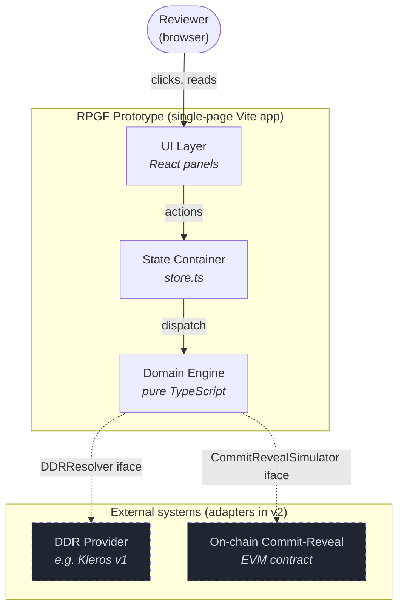
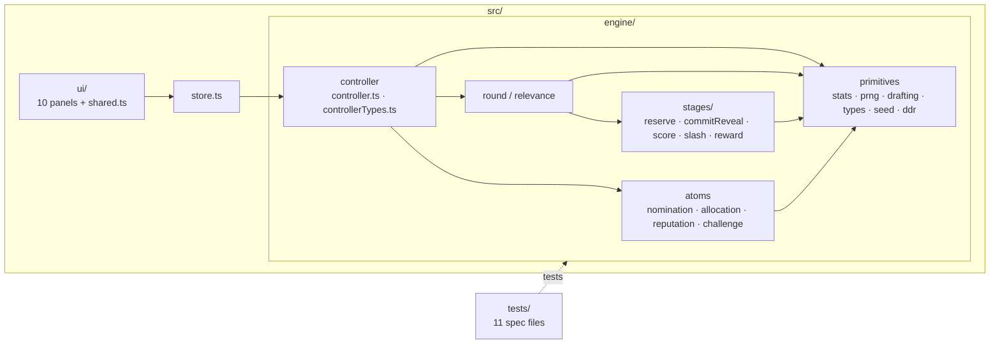
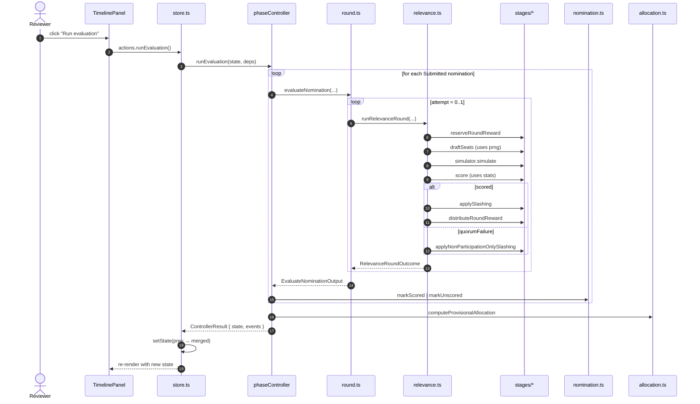
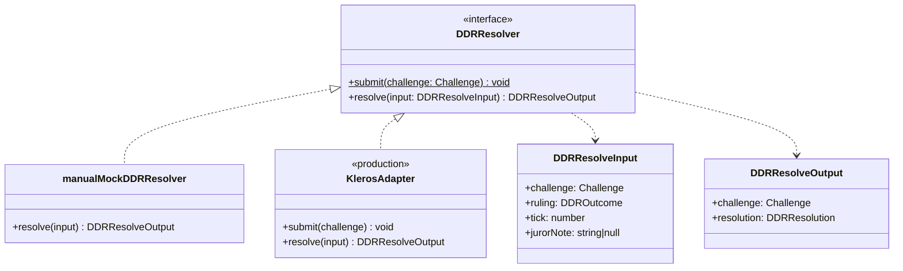
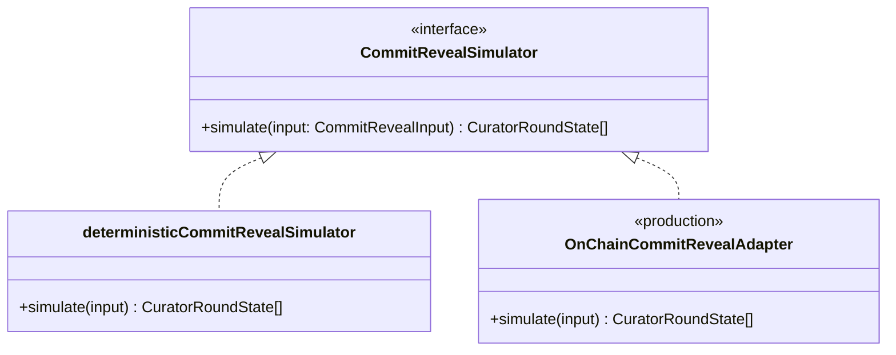
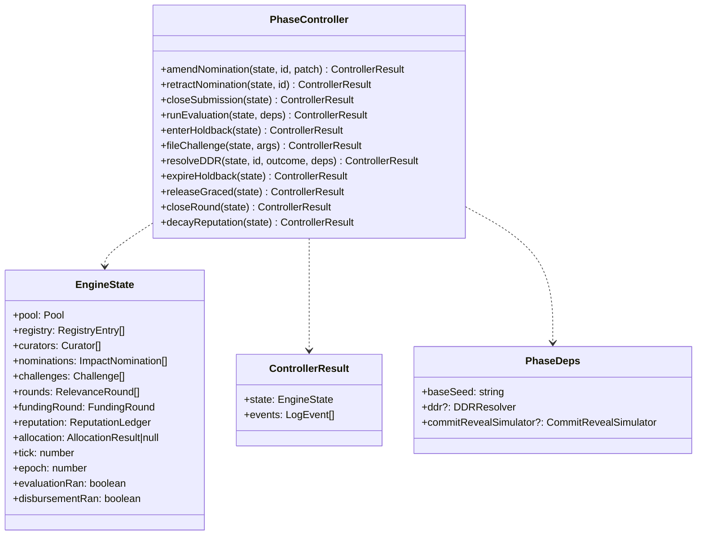

# Architecture

This document maps the prototype's structure using standard software-modeling
diagrams: a C4-style **container diagram** for the high-level shape, a
**component diagram** for the engine internals, a **package diagram** for
folder grouping, a **sequence diagram** for runtime flow, and **class
diagrams** for the swap-point interfaces. Every diagram is Mermaid; renders
in IntelliJ (with the Mermaid plugin), GitHub, and Quarto without extra
tooling.

---

## 1. Container diagram (system shape)

Shows the deployable units of the prototype and the external systems they
adapt. Production swaps the two adapters; everything else stays.

Solid arrows are direct calls inside the prototype. Dashed arrows are
interface boundaries that today resolve to mock implementations and in
production resolve to chain adapters.

---

## 2. Component diagram (engine internals)

Each component is one or more `.ts` modules with a single responsibility.
Provided interfaces are shown as dashed boxes; the rest are concrete modules.

```mermaid
flowchart TB
  subgraph store_layer["store.ts (React glue)"]
    store["useAppStore"]
  end

  subgraph facade["Phase facade"]
    controller["controller.ts<br/>phaseController"]
  end

  subgraph atoms["Engine atoms (pure)"]
    nom["nomination.ts<br/>state machine"]
    alloc["allocation.ts<br/>alloc + redistribute"]
    rep["reputation.ts<br/>immutable ledger"]
    chal["challenge.ts<br/>filing + payout"]
  end

  subgraph round_layer["Round orchestration"]
    round["round.ts<br/>retry loop"]
    relevance["relevance.ts<br/>pipeline composer"]
  end

  subgraph stages_layer["Stages (per-phase atoms)"]
    s_reserve["reserve"]
    s_draft["drafting.ts"]
    s_cr["commitReveal"]
    s_score["score"]
    s_slash["slash"]
    s_reward["reward"]
  end

  subgraph prim["Primitives"]
    stats["stats.ts"]
    prng["prng.ts"]
  end

  ddr_iface[/"&laquo;interface&raquo;<br/>DDRResolver"/]
  cr_iface[/"&laquo;interface&raquo;<br/>CommitRevealSimulator"/]
  ddr_mock["manualMockDDRResolver"]
  cr_mock["deterministicCommitRevealSimulator"]

  store --> controller
  controller --> nom
  controller --> alloc
  controller --> rep
  controller --> chal
  controller --> round
  controller -. requires .-> ddr_iface
  ddr_mock -. provides .-> ddr_iface

  round --> relevance
  relevance --> s_reserve
  relevance --> s_draft
  relevance -. requires .-> cr_iface
  cr_mock -. provides .-> cr_iface
  relevance --> s_score
  relevance --> s_slash
  relevance --> s_reward

  s_score --> stats
  s_slash --> stats
  s_reward --> stats
  s_draft --> prng

  classDef iface stroke-dasharray: 5 5,fill:#1f2630
  classDef mock fill:#0e1116,stroke:#56d364
  class ddr_iface,cr_iface iface
  class ddr_mock,cr_mock mock
```

The controller is the only multi-step coordinator. Atoms each own one
concern. Stages are sequenced by `relevance.ts`; primitives are leaf
modules with no engine knowledge.

---

## 3. Package diagram (folder grouping)

Maps directly to the on-disk layout. Arrows show allowed cross-package
imports; anything not drawn is forbidden by the dependency layering.

Constraints encoded by the layout:

- `ui/` may import from `store.ts` only. No direct engine import.
- `store.ts` may import from `engine/` (controller + types only) and
  `engine/seed.ts` for bootstrap. Never engine internals.
- `engine/controller.ts` is the engine's only multi-step coordinator.
- Stages, atoms, and primitives are leaf modules: each may only import
  from its own package and `primitives`.
- `tests/` may import from anywhere in `engine/`; not from `ui/`.

---

## 4. Sequence diagram (runtime: "Run evaluation")

Shows what happens when the reviewer clicks the "Run evaluation" button on
the timeline panel. Other actions follow the same shape: UI dispatches to
store, store calls one controller method, controller composes engine atoms,
result returns up the stack.

Key invariants visible in the diagram:

- Every controller call is a single dispatch. The store never coordinates
  multi-step engine flows directly.
- The retry loop lives entirely in `round.ts`; the controller never sees
  individual attempts.
- Stages run in fixed order inside `relevance.ts`. Adding a stage means
  editing one orchestrator, not the controller.

---

## 5. Class diagrams (swap-point interfaces)

The two contracts that production must implement to replace the
prototype's mocks.

Every public type listed here corresponds to one exported declaration in
`src/engine/`. Tests pin each contract: `tests/ddr.test.ts` covers the
DDR boundary, `tests/stages.test.ts` covers the simulator boundary, and
`tests/controller.test.ts` covers the controller surface plus its
immutability invariant.

---

## Diagram choice rationale

| Diagram | Purpose here | Standard intent |
|---|---|---|
| Container | Show the prototype as one deployable unit and its external adapters | C4 level 2: deployable runtime units |
| Component | Show the modules inside the engine and which interfaces they require/provide | C4 level 3 / UML 2 component diagram |
| Package | Show folder/namespace grouping and the layering rules | UML 2 package diagram |
| Sequence | Show one user action's call path through the system | UML 2 interaction diagram |
| Class | Pin the swap-point interface contracts | UML 2 class diagram |

This set covers structure (packages, components, classes), runtime
behavior (sequence), and deployment/integration boundaries (container).
Sufficient for any future work to be planned against a fixed surface.
