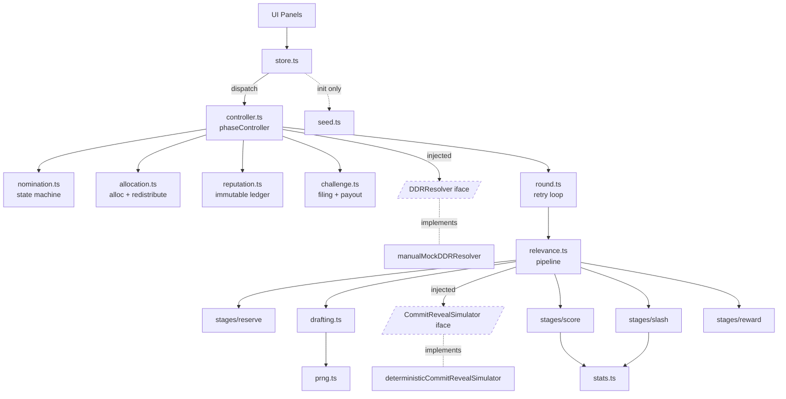

# Architecture

This document maps the prototype's module dependencies, runtime data flow,
and swap-point interfaces.

## Module dependency layers (compile-time imports)

```
┌─────────────────────────────────────────────────────────────────────┐
│  UI LAYER (React)                                                   │
│  ┌──────────────────────────────────────────────────────────────┐   │
│  │ App.tsx                                                      │   │
│  │   ├─ TimelinePanel    ├─ NominationsPanel   ├─ AllocationPanel│  │
│  │   ├─ PoolPanel        ├─ RoundsPanel        ├─ ChallengesPanel│  │
│  │   ├─ RegistryPanel    ├─ CuratorsPanel      ├─ ReputationPanel│  │
│  │   └─ LogPanel                               └─ shared (fmt)   │  │
│  └────────┬─────────────────────────────────────────────────────┘   │
│           │ reads `state`, calls `actions`                          │
│           ▼                                                         │
│  ┌──────────────────────────────────────────────────────────────┐   │
│  │ store.ts  (useAppStore: useState + dispatch wrapper)         │   │
│  └────────┬─────────────────────────────────────────────────────┘   │
└───────────┼─────────────────────────────────────────────────────────┘
            │ dispatch(op): setState(applyControllerResult(prev, op(prev)))
            ▼
┌─────────────────────────────────────────────────────────────────────┐
│  ENGINE FACADE                                                      │
│  ┌──────────────────────────────────────────────────────────────┐   │
│  │ controller.ts  (phaseController.<action>)                    │   │
│  │   amendNomination · retractNomination · closeSubmission      │   │
│  │   runEvaluation · enterHoldback · fileChallenge · resolveDDR │   │
│  │   expireHoldback · releaseGraced · closeRound · decayReputation│ │
│  │   In: (EngineState, args, PhaseDeps)                         │   │
│  │   Out: { state: EngineState, events: LogEvent[] }            │   │
│  └────┬───────────────┬───────────────┬──────────────┬──────────┘   │
└───────┼───────────────┼───────────────┼──────────────┼──────────────┘
        │               │               │              │
        ▼               ▼               ▼              ▼
┌─────────────┐ ┌─────────────┐ ┌─────────────┐ ┌────────────────────┐
│ ENGINE ATOMS│ │ ENGINE ATOMS│ │ ENGINE ATOMS│ │ ROUND ORCHESTRATOR │
│ (pure)      │ │ (pure)      │ │ (pure)      │ │                    │
│ ──────────  │ │ ──────────  │ │ ──────────  │ │  round.ts          │
│ nomination  │ │ allocation  │ │ reputation  │ │  evaluateNomination│
│ (state mch) │ │ (alloc+redis)│ │ (ledger ops)│ │  (retry loop)      │
│             │ │             │ │             │ └─────────┬──────────┘
│ challenge   │ │  ddr        │ │             │           │
│ (filing+    │ │  ┌──────┐   │ │             │           ▼
│  payout)    │ │  │interface│ │             │ ┌────────────────────┐
└─────┬───────┘ │  │DDRResolver││ │             │ │ relevance.ts       │
      │         │  └──┬──┬───┘  │ │             │ │ pipeline:          │
      │         │     │  │      │ │             │ │ reserve→draft→     │
      │         │     │  └─────►│ │             │ │ commitReveal→score │
      │         │     │ manual  │ │             │ │ →slash→reward→ema  │
      │         │     │  Mock   │ │             │ └─────┬──────────────┘
      │         │     │         │ │             │       │
      │         └─────┴─────────┘ │             │       ▼
      │                           │             │ ┌────────────────────┐
      │                           │             │ │ stages/            │
      │                           │             │ │ ──────             │
      │                           │             │ │ reserve            │
      │                           │             │ │ commitReveal       │
      │                           │             │ │  ├─ Simulator      │
      │                           │             │ │  └─ deterministic  │
      │                           │             │ │ score              │
      │                           │             │ │ slash              │
      │                           │             │ │ reward             │
      │                           │             │ └────┬───────────────┘
      ▼                           ▼             ▼      │
┌─────────────────────────────────────────────────────┐│
│ PRIMITIVES                                          ││
│ ──────────                                          ▼│
│ stats.ts          drafting.ts        prng.ts         │
│ (mean/sigma/EMA)  (seat allocation)  (mulberry32)    │
└─────────────────────────────────────────────────────┘
                            │
                            ▼
┌─────────────────────────────────────────────────────┐
│ TYPES (consumed by every layer; no dependencies)    │
│ types.ts · controllerTypes.ts                       │
└─────────────────────────────────────────────────────┘

       ┌─────────────────────────────┐
SEED:  │ seed.ts → bootstrap data    │  (read at store init only)
       │ Pool, Registry, Curators,   │
       │ Nominations, BASE_SEED      │
       └─────────────────────────────┘
```

## Runtime data flow (one user action: "Run evaluation")

```
[user click]
     │
     ▼
TimelinePanel "2. Run evaluation"
     │  actions.runEvaluation()
     ▼
store.runEvaluation
     │  dispatch(s => phaseController.runEvaluation(s, DEFAULT_DEPS))
     ▼
phaseController.runEvaluation(state, deps)
     │  for each Submitted nomination:
     ▼
round.evaluateNomination
     │  attempt = 0..1
     ▼
relevance.runRelevanceRound
     │
     ├──► stages.reserveRoundReward           (reads: budget, params)
     │       └─► returns reservedReward OR underfunded
     │
     ├──► drafting.draftSeats                 (uses prng.createPRNG)
     │       └─► returns seats[] + underfunded flag
     │
     ├──► CommitRevealSimulator.simulate      (default = deterministic)
     │       └─► returns CuratorRoundState[]
     │
     ├──► stages.score                        (uses stats.weightedMean/StdDev)
     │       └─► returns scored | quorumFailure
     │
     ├──► stages.applySlashing                (uses stats.graduatedPenaltyFraction)
     │       └─► returns updated states + totalSlashed
     │
     ├──► stages.distributeRoundReward
     │       └─► returns updated states + distributed
     │
     └──► stages.settleCurationBudget + stats.emaUpdate
             └─► returns curationBudgetAfter, emaSigmaAfter

returns RelevanceRoundOutcome to round → controller
     │
     ▼
controller folds outcomes:
     ├─► nomination.markScored / markUnscored          (state machine)
     ├─► allocation.computeProvisionalAllocation       (proportional alloc)
     └─► emits LogEvent[]
     │
     ▼
ControllerResult { state: EngineState', events: [...] }
     │
     ▼
store.applyControllerResult: { ...state', log: [...prev.log, ...events] }
     │
     ▼
React setState → re-render
     │
     ▼
UI panels read new state from props (window.__rpgf also reflects it)
```

## Swap-point interfaces

```
┌────────────────────────────────────────────────────────────────┐
│ DDRResolver                                                    │
│   resolve({challenge, ruling, tick, jurorNote})                │
│     → {challenge, resolution}                                  │
│   submit?(challenge)  // optional production hook              │
│                                                                │
│   Implementations:                                             │
│     manualMockDDRResolver  (prototype)                         │
│     [your KlerosAdapter]   (production)                        │
└────────────────────────────────────────────────────────────────┘

┌────────────────────────────────────────────────────────────────┐
│ CommitRevealSimulator                                          │
│   simulate({draftedSeats, curators, parameters})               │
│     → CuratorRoundState[]                                      │
│                                                                │
│   Implementations:                                             │
│     deterministicCommitRevealSimulator  (prototype)            │
│     [your OnChainCommitRevealAdapter]   (production)           │
└────────────────────────────────────────────────────────────────┘

┌────────────────────────────────────────────────────────────────┐
│ phaseController.<action>: (EngineState, args, PhaseDeps)       │
│                            → ControllerResult                  │
│                                                                │
│   The single boundary store.ts touches.                        │
│   The single boundary tests can drive without React.           │
└────────────────────────────────────────────────────────────────┘
```

## Mermaid graph (renders in GitHub, Quarto, IDEs)



## Notes

- Dashed boxes in the mermaid graph are interfaces (swap points).
- Solid arrows are direct calls; dotted arrows mark one-shot init reads.
- Every box below the controller is pure: no React, no DOM, no I/O.
- The controller is the only multi-step coordinator. Engine atoms
  (state machine, allocation, reputation, challenge, ddr) stay focused
  on a single concern; the controller composes them.
- Test boundaries match the diagram: each module has its own test file
  driving its public types directly. `controller.test.ts` covers the
  facade; the UI is exercised via Playwright but not unit-tested.
