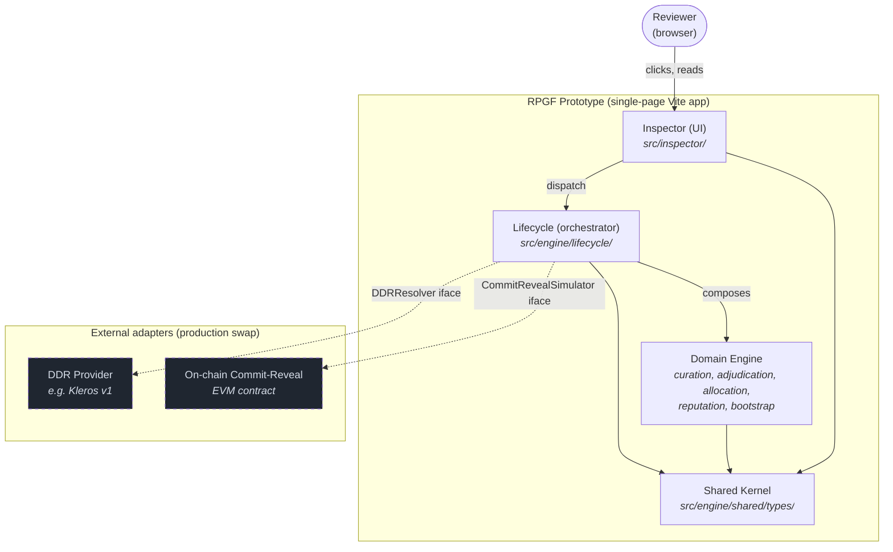
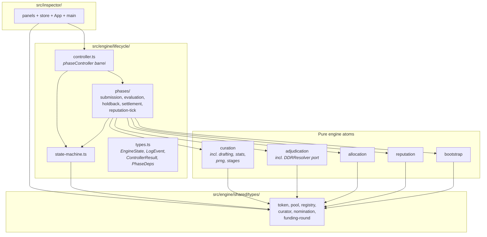
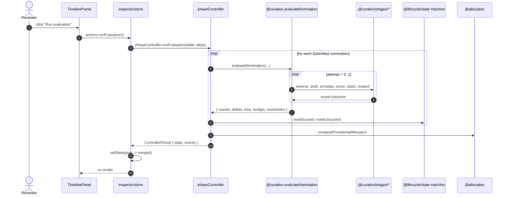
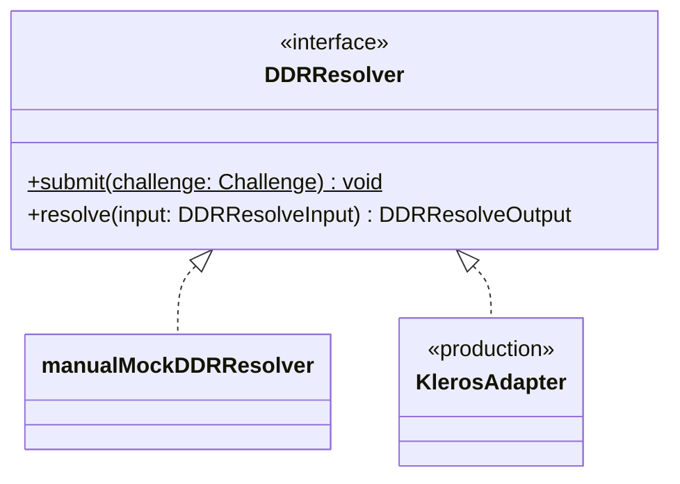
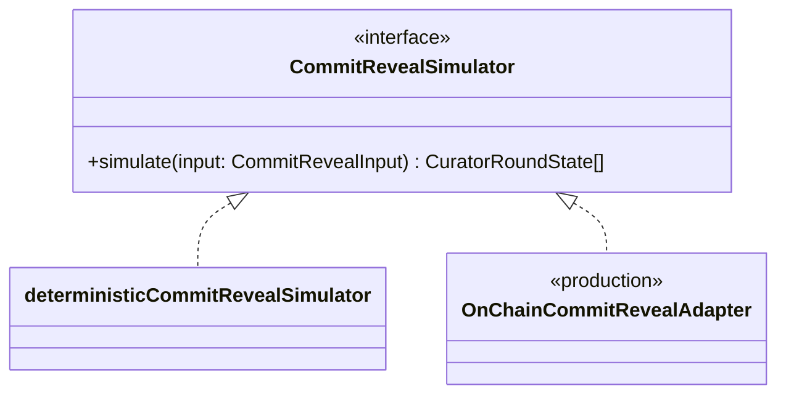

# Architecture

This document describes the prototype's seven top-level modules, their
public interfaces, the rules that govern how they may import each other,
and how data flows through the system at runtime. Diagrams use Mermaid;
they render in IntelliJ (with the Mermaid plugin), GitHub, and Quarto.

## Modules (one job each)

| # | Module | Path | Job |
|---|---|---|---|
| 1 | Bootstrap | `src/engine/bootstrap/` | Produce deterministic mock data: pool config, registry, curator identities + initial financial state, seeded nominations. |
| 2 | Curation | `src/engine/curation/` | Score a nomination via the coherence game (one round, with retry on quorum failure). |
| 3 | Adjudication | `src/engine/adjudication/` | Resolve disputes: file challenges, run external DDR (via injected resolver), apply payouts. |
| 4 | Allocation | `src/engine/allocation/` | Compute money flows from relevance scores; redistribute the debunked share to surviving disbursed. |
| 5 | Reputation | `src/engine/reputation/` | Track per-registry-entry honesty: +1 surviving, -5 debunked, decay 1 per epoch toward zero. |
| 6 | Lifecycle | `src/engine/lifecycle/` | Drive nominations through the state machine across pool phases; orchestrate Curation/Adjudication/Allocation/Reputation. |
| 7 | Inspector | `src/inspector/` | Render engine state and dispatch reviewer actions in a browser. |

Plus the supporting layer:

- `src/engine/shared/types/` - shared kernel of cross-module data shapes
  (Token, PoolMeta, RegistryEntry, CuratorIdentity, ImpactNomination, etc.).
  No logic, only shapes. Every module may import from here.

## Container diagram (system shape)



## Component diagram (engine internals)



## Allowed module-import edges (ESLint enforced)

`eslint-plugin-boundaries` declares each directory as a typed element and
the rules below pin the allowed import graph. Lint runs on every push.

| From | Allowed targets |
|---|---|
| `shared` | (nothing) |
| `bootstrap` | shared, bootstrap (self) |
| `curation` | shared, curation (self) |
| `adjudication` | shared, adjudication (self) |
| `allocation` | shared, allocation (self) |
| `reputation` | shared, reputation (self) |
| `lifecycle` | shared, lifecycle (self), curation, adjudication, allocation, reputation, bootstrap |
| `inspector` | shared, lifecycle, bootstrap |
| `tests` | any module |

Cross-module imports MUST go through each module's `index.ts` barrel
(e.g. `import { evaluateNomination } from "@curation"`). Path aliases
(`@curation`, `@lifecycle`, etc.) are configured in `tsconfig.json`,
`vite.config.ts`, and `eslint.config.js` (via `eslint-plugin-import`'s
TypeScript resolver) so the boundaries rule actually checks aliased
edges instead of silently skipping them.

## Adapter ports (inline in consuming module)

| Port | Owner | Default mock | Production swap |
|---|---|---|---|
| `DDRResolver` | adjudication | `manualMockDDRResolver` | drop `KlerosAdapter` in adjudication; pass via `PhaseDeps.ddr` |
| `CommitRevealSimulator` | curation | `deterministicCommitRevealSimulator` | drop `OnChainCommitRevealAdapter` in curation; pass via `PhaseDeps.commitRevealSimulator` |

Each port lives in its consuming module's barrel. Adapters implement the
port and are injected through `PhaseDeps` at the controller boundary.

## Slice ownership

`EngineState` is the engine's shared envelope. Each field has exactly one
writer module:

| Field(s) | Owner |
|---|---|
| `pool.id`, `pool.name`, `pool.registryId`, `pool.parameters`, `registry`, identity portion of `curators` | bootstrap (init only) |
| `pool.emaSigma`, `pool.curationBudget`, `rounds`, financial portion of `curators` | curation |
| `pool.fundingBudget`, `pool.budgetRolloverToken`, `allocation` | allocation |
| `challenges` | adjudication |
| `reputation` | reputation |
| `pool.phase`, `pool.currentRoundId`, `nominations`, `fundingRound`, `tick`, `epoch`, `evaluationRan`, `disbursementRan` | lifecycle |

The flat `EngineState` shape is preserved during the incremental refactor;
slice ownership is enforced by the controller composition pattern (each
phase function reads/writes only the fields owned by its module). A
future revision may group slices structurally for compile-time
enforcement.

## Public API per module

### `@bootstrap`
```ts
makePool(): Pool
makeRegistry(): RegistryEntry[]
makeCurators(): Curator[]            // Curator extends CuratorIdentity
makeNominations(): ImpactNomination[]
const REFERENCE_POOL_PARAMETERS: PoolParameters
const PROTOTYPE_BASE_SEED, PROTOTYPE_POOL_ID, PROTOTYPE_FUNDING_ROUND_ID
```

### `@curation`
```ts
type RelevanceRound, RoundPhase, CuratorRoundState, CuratorFinancialState
type CommitRevealSimulator, CommitRevealInput
type EvaluateNominationInput, EvaluateNominationOutput
const deterministicCommitRevealSimulator: CommitRevealSimulator

evaluateNomination(input): EvaluateNominationOutput
runRelevanceRound(input): RelevanceRoundOutcome
```

### `@adjudication`
```ts
type Challenge, ChallengeReason, ChallengeStatus, DDROutcome, ChallengePayout
type DDRResolver, DDRResolveInput, DDRResolveOutput, DDRResolution
class ChallengeFilingError, DDRResolutionError
const manualMockDDRResolver: DDRResolver

fileChallenge(input): Challenge
computeCounterStake(provisionalShare, params): Token
computeChallengeTax(provisionalShare, params): Token
challengePayoutFor(outcome, challenge): ChallengePayout
resolveChallenge(challenge, ruling, tick, jurorNote, resolver?)
```

### `@allocation`
```ts
type AllocationResult, AllocationRow, RedistributionResult

computeProvisionalAllocation(input): AllocationResult
redistributeDebunkedShare(input): RedistributionResult
```

### `@reputation`
```ts
type ReputationLedger, ReputationLedgerEntry, ReputationLedgerEvent

emptyLedger(): ReputationLedger
ensureEntry(ledger, registryEntryId, poolId, init): ReputationLedger
awardSurvivingRound(ledger, ...): ReputationLedger
applyDebunkPenalty(ledger, ...): ReputationLedger
decayEpoch(ledger, poolId, decay, tick): { ledger, updatedIds }
```

### `@lifecycle`
```ts
type EngineState, LogEvent, LogCategory, ControllerResult, PhaseDeps
type FileChallengeArgs, AmendInput
class NominationTransitionError

// state-machine atoms (pure)
amendDuringSubmission, retractNomination, markScored, markUnscored,
markDisputed, markDebunked, markChallengeFailed, markDisbursed,
topUpFinalShare

// phase actions (composed)
const phaseController: {
  amendNomination, retractNomination, closeSubmission,
  runEvaluation, enterHoldback,
  fileChallenge, resolveDDR, expireHoldback,
  releaseGraced, closeRound, decayReputation,
}
```

### `@shared/types/*` (kernel)
```ts
Token, PoolMeta, PoolParameters, PoolPhase, RegistryEntry,
CuratorIdentity, CommitRevealBehavior,
ImpactNomination, NominationState, AdjudicationOutcome,
Assertion, EvidenceItem, EvidenceClass, FundingRound
```

## Runtime data flow ("Run evaluation")



## Swap-point interfaces (class diagrams)





## Test layout

Tests are co-located alongside source by file naming convention:
`<source>.test.ts` next to the source. The legacy top-level `tests/`
directory still holds integration tests and module-level tests pending
migration. `vitest` includes both:

```ts
include: ["src/**/*.test.ts", "src/**/*.test.tsx", "tests/**/*.test.ts"]
```

86 tests pass after the refactor (no semantic change). The test count
matches the pre-refactor baseline.

## File tree (as of refactor end)

```
projects/rpgf/prototype/
├── ARCHITECTURE.md         <- this file
├── PROTOTYPE_PROFILE.md    <- frozen scope, deviations from spec
├── README.md               <- run instructions, spec mapping
├── package.json
├── tsconfig.json           <- path aliases
├── vite.config.ts          <- mirrored aliases + vitest include
├── eslint.config.js        <- module-import boundary rules
├── index.html
├── src/
│   ├── engine/
│   │   ├── shared/
│   │   │   └── types/      <- shared kernel (no logic)
│   │   ├── bootstrap/      <- mock data factories
│   │   ├── curation/
│   │   │   ├── index.ts    <- public barrel
│   │   │   ├── types.ts
│   │   │   ├── stats.ts    <- private
│   │   │   ├── prng.ts     <- private
│   │   │   ├── drafting.ts <- private
│   │   │   ├── stages/     <- private (reserve, score, slash, reward, commit-reveal)
│   │   │   ├── relevance.ts
│   │   │   ├── round.ts
│   │   │   └── types.ts
│   │   ├── adjudication/   <- challenge + DDR
│   │   ├── allocation/
│   │   ├── reputation/
│   │   └── lifecycle/
│   │       ├── index.ts
│   │       ├── types.ts        <- EngineState, LogEvent, ControllerResult
│   │       ├── state-machine.ts
│   │       ├── state-init.ts   <- makeInitialEngineState, makeDefaultPhaseDeps
│   │       ├── controller.ts
│   │       └── phases/         <- per-stage phase functions (holdback is a sub-dir)
│   └── inspector/
│       ├── main.tsx
│       ├── App.tsx
│       ├── store.ts        <- thin React wrapper around phaseController
│       ├── styles.css
│       └── panels/         <- 10 panels + shared.ts (fmt helpers)
└── tests/                  <- 11 test files, ~86 assertions
```

## Verification

```bash
cd projects/rpgf/prototype
npm install
npm run typecheck            # clean
npm run lint                 # clean (boundary rules active)
npm test                     # 86/86 pass
npm run build                # ~199 KB JS, ~5.7 KB CSS
npm run dev                  # http://localhost:5173
```

Browser smoke (Playwright-driven during the refactor):

1. Click "Close submission" -> phase = Evaluation.
2. Click "Run evaluation" -> 5 nominations scored; allocation populates.
3. Click "Open holdback".
4. File a Debunking challenge against `nom-modular-vm-bogus-deploy`.
5. Click "Expire holdback" -> 4 nominations disburse; debunk target stays in escrow.
6. Click "Debunked" on the open challenge -> 20.42 token redistributed pro-rata; sum of finals = 95.00.
7. Reputation: 4 entries +1, debunk target -5, others 0.

Console must remain free of errors and warnings.
